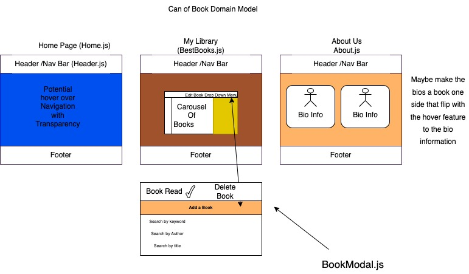

# Project Name

**Authors**: Eva Grace Smith and Chris Vander Linden
**Version**: 1.0.0 
<!-- (increment the patch/fix version number if you make more commits past your first submission) -->

## Overview
This is the frontend for the can of books project.  It connects to our backend, which can be found here: [https://github.com/Chris-Vander-Linden/can-of-books-backend](https://github.com/Chris-Vander-Linden/can-of-books-backend)

## Getting Started
    git clone git@github.com:EvaGraceSmith/can-of-books-frontend.git

    npx create-react-app

    npm start

## Architecture
This project uses React, node.js, express.js, mongo.DB, mongoose, cors, Google Books API

## Change Log
<!-- Use this area to document the iterative changes made to your application as each feature is successfully implemented. Use time stamps. Here's an example:

01-01-2001 4:59pm - Application now has a fully-functional express server, with a GET route for the location resource. -->
* 2-18-23 8:00am Add Book function now working
* 2-18-23 5:00pm Delete button is now functioning
* 2-19-23 9:00pm Update Read status is now functioning
* 2-24-23 11:00pm OAuth added to front end

### 
### 

## Estimates
Name of feature: __________Lab 11- Carousel______________________

Estimate of time needed to complete: ___3 hrs__

Start time: ___9:00 am__

Finish time: __12:00 pm___

Actual time needed to complete: ___3__

Name of feature: ___Lab 11 - Navigation Links_____________________________

Estimate of time needed to complete: ____1 hr_

Start time: __11:00___

Finish time: ___2:00__

Actual time needed to complete: __3 hrs___

Name of feature: ________________________________

Estimate of time needed to complete: _____

Start time: _____

Finish time: _____

Actual time needed to complete: _____

#### Lab 11

[React Router](https://www.w3schools.com/react/react_router.asp)

[Intro to React Router](https://medium.com/@ipenywis/intro-to-react-router-for-beginners-multiple-page-apps-461f4729bd3f#:~:text=For%20a%20website%20or%20a%20simple%20multi-page%20app%2C,redirect%20from%20route%20to%20another%20and%20404%20pages.)

#### Lab 12

Name of feature: _Add Modal_______________________________

Estimate of time needed to complete: __1hr___

Start time: __6_pm__

Finish time: _12pm____

Actual time needed to complete: __6___

Name of feature: _____Add a Book Button___________________________

Estimate of time needed to complete: __3hrs___

Start time: ___12_pm_

Finish time: __3_pm__

Actual time needed to complete: __3___

Name of feature: __Add Delete_Functionality_____________________________

Estimate of time needed to complete: _1 hr____

Start time: __4pm___

Finish time: __5pm___

Actual time needed to complete: __1___

[Flip Card](https://www.w3schools.com/howto/howto_css_flip_card.asp)

### Lab 13

Name of feature: __________Update Book Read checkbox Feature______________________

Estimate of time needed to complete: __1 hr___

Start time: __7pm___

Finish time: __9pm___

Actual time needed to complete: __2 hrs___

[Checkboxes in react](https://stackoverflow.com/questions/53498299/how-to-send-checkbox-data-in-reactjs)

[Checkboxes](https://www.w3schools.com/jsref/prop_checkbox_checked.asp)

### Lab 14

Name of feature: ________OAuth________________________

Estimate of time needed to complete: ___1hr__

Start time: __8:00pm___

Finish time: ___9:00pm__

Actual time needed to complete: __1hr___

[provided OAuth Code](https://github.com/DeltaVCode/cedarrapids-code-301n1/tree/main/class-15/lab/starter-code/client/Auth)

[auth0](https://auth0.com/docs/libraries/auth0-react)

## Credit and Collaborations

Image by <a href="https://pixabay.com/users/hermann-130146/?utm_source=link-attribution&amp;utm_medium=referral&amp;utm_campaign=image&amp;utm_content=5937823">Hermann Traub</a> from <a href="https://pixabay.com//?utm_source=link-attribution&amp;utm_medium=referral&amp;utm_campaign=image&amp;utm_content=5937823">Pixabay</a>
Image by <a href="https://pixabay.com/users/skitterphoto-324082/?utm_source=link-attribution&amp;utm_medium=referral&amp;utm_campaign=image&amp;utm_content=2344423">Rudy and Peter Skitterians</a> from <a href="https://pixabay.com//?utm_source=link-attribution&amp;utm_medium=referral&amp;utm_campaign=image&amp;utm_content=2344423">Pixabay</a>
Image by <a href="https://pixabay.com/users/fotoblend-87167/?utm_source=link-attribution&amp;utm_medium=referral&amp;utm_campaign=image&amp;utm_content=4032668">Willfried Wende</a> from <a href="https://pixabay.com//?utm_source=link-attribution&amp;utm_medium=referral&amp;utm_campaign=image&amp;utm_content=4032668">Pixabay</a>
Image by <a href="https://pixabay.com/users/moritz320-1260270/?utm_source=link-attribution&amp;utm_medium=referral&amp;utm_campaign=image&amp;utm_content=3330647">günter</a> from <a href="https://pixabay.com//?utm_source=link-attribution&amp;utm_medium=referral&amp;utm_campaign=image&amp;utm_content=3330647">Pixabay</a>
Image by <a href="https://pixabay.com/users/fernandozhiminaicela-6246704/?utm_source=link-attribution&amp;utm_medium=referral&amp;utm_campaign=image&amp;utm_content=3197260">fernando zhiminaicela</a> from <a href="https://pixabay.com//?utm_source=link-attribution&amp;utm_medium=referral&amp;utm_campaign=image&amp;utm_content=3197260">Pixabay</a>
Image by <a href="https://pixabay.com/users/trixieliko-5446132/?utm_source=link-attribution&amp;utm_medium=referral&amp;utm_campaign=image&amp;utm_content=2695011">Trixie Liko</a> from <a href="https://pixabay.com//?utm_source=link-attribution&amp;utm_medium=referral&amp;utm_campaign=image&amp;utm_content=2695011">Pixabay</a>
Image by <a href="https://pixabay.com/users/12019-12019/?utm_source=link-attribution&amp;utm_medium=referral&amp;utm_campaign=image&amp;utm_content=1624410">David Mark</a> from <a href="https://pixabay.com//?utm_source=link-attribution&amp;utm_medium=referral&amp;utm_campaign=image&amp;utm_content=1624410">Pixabay</a>
Image by <a href="https://pixabay.com/users/dezalb-1045091/?utm_source=link-attribution&amp;utm_medium=referral&amp;utm_campaign=image&amp;utm_content=1578634">DEZALB</a> from <a href="https://pixabay.com//?utm_source=link-attribution&amp;utm_medium=referral&amp;utm_campaign=image&amp;utm_content=1578634">Pixabay</a>
Photo by <a href="https://unsplash.com/@deko_photo4?utm_source=unsplash&utm_medium=referral&utm_content=creditCopyText">Valdemaras D.</a> on <a href="https://unsplash.com/s/photos/library?utm_source=unsplash&utm_medium=referral&utm_content=creditCopyText">Unsplash</a>
  

[Chris Vander Linden](https://github.com/Chris-Vander-Linden): Collaborator and code reviewer
[Jack Stubblefield](https://github.com/Jacks-01): DeltaV TA
[Craig Barkley](https://github.com/tektechnologies): DeltaV course instructor